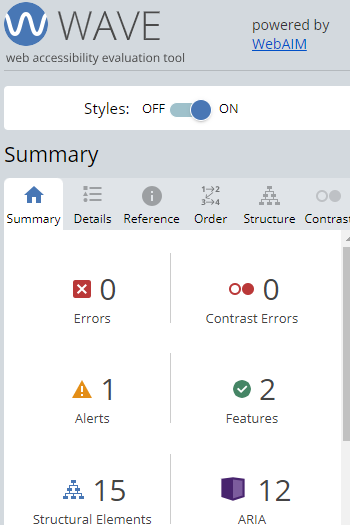
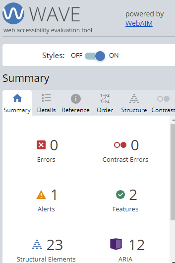
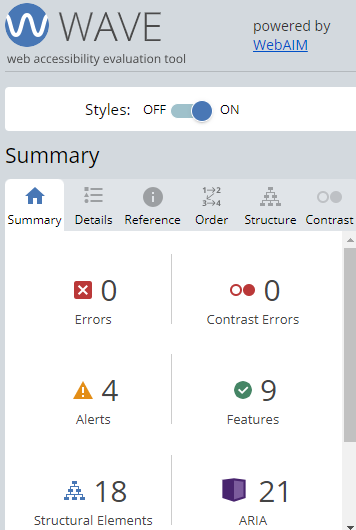

# Debt Deliverance Website

[View the deployed version here.](https://duffew.github.io/debt-deliverance/)

The Debt Deliverance website is a 3-page lifehacks website, designed as a landing pad for people struggling with debt. Its purpose is to provide hope, practical advice and further references to anyone looking to begin managing their debt.

Users of this website will find: 
+ a positive message about their circumstances 
+ advice on behaviour, principles and the process of getting out of debt
+ links to resources which may help including a newsletter sign-up form

This website is responsive for all screen sizes.

## Features

### Welcome Page

+ **Header** - The header on all pages contains a logo in the top left corner. This level 1 heading logo, when selected, will return users to the Welcome page.

+ **Navigation Bar** - On screens up to a width of 768 pixels, the navigation bar can be toggled by selecting the burger icon in the top right. On screens above 768 pixels, the page names are displayed. On all devices the current page is indicated using red font colour.
    
     
        
    *Mobile logo and menu icon*
        
     
        
    *Mobile menu toggled open*

     
        
    *Logo and navigation bar on larger screens*

    On devices with the full navigation bar displayed, page names change colour when the user hovers with a mouse.

+ **Hero Image** - The Welcome page opens with a large image of a flower. The purpose is to greet a visitor with a calming picture that puts users in mind of a garden. The overlay text uses level 2 headings to clearly articulate the purpose of the website.

     
        
    *Hero image with text overlay*

+ **Text Content** - The text is organised into four introductory paragraphs, each titled using a level 3 heading. The purpose of each paragraph is to:
    - **Welcome** - show the user that we understand why they are here
    - **It's usual to feel bad** - show empathy for users who might be in a heightened emotional state
    - **Have hope** - provide a hopeful message and list the steps of a breathing exercise to help users relax
    - **Let's begin** - provide direction for using the rest of the website

    
    

    *Welcome page paragraphs*

    The headings have been styled using the same font face and colour as the site logo to provide consistency. A declaration has been applied to the paragraphs and list elements to adjust the line height and allow the text to breath.

+ **Footer** - The footer contains links to popular social media websites. Each link opens in a new tab and is aria labelled for accessibility purposes. These icons follow the same hover rules as the main navigation links.

    

    *Footer showing social media links*

### Steps Page
+ **Bridge Metaphor Image** - The image of the bridge provides visual clarification that the user is on a new page. The bridge is in a garden, building on the Garden theme established with the Welcome page. The bridge also represents crossing over from one place to another. As the user follows the steps to get out of debt, they too should cross a divide. The red font highlighting the user's current page was colour picked from this image to provide consistency.

    

    *Screenshot of the Bridge metaphor image*

+ **Internal Navigation** - To aid the user in moving around the page, internal navigation links have been provided beneath the metaphor image. These links use upper case lettering to distinguish them from the main site navigation links. The font face and colour match that of the sections to which they relate. The links obey the same hover rules as the other navigation links.

    

    *Internal navigation links*

+ **Text Content** - The text is divided into the following sections:
    - Behaviour
    - Principles
    - Process

    The purpose to these sections is to promote a behaviour shift by encouraging a principles-based approach to getting out of debt.

    

    *Behaviour section*

    

    *Principles sections*

    

    *Process section*

    Each section has font faces and colour schemes consistent with those already introduced. Line spacing is also consistent. The slight differences in styling from one section to another - red font within Principles and a numbered list with green font within Process - enables the user to visually distinguish one section from another.

+ **Metaphor Images** - This page also includes a number of metaphor images. These images continue to build the Garden theme and provide visual representations of the ideas described. The lantern acts as a guiding light to represent principles. The two chairs surrounded by utensils represents two people sitting together to plan their process. The ladder represents beginning work and moving upwards out of debt. As users select the Principles and Process internal navigation links, the page will jump to the metaphor image preceding the text.

     
        
    *Lantern - principles metaphor*

     
        
    *Chairs - process metaphor*

     
        
    *Ladder - get to work metaphor*

### Resources Page
+ **Signup Form** - This page gives users the opportunity to complete a form and sign-up for a newsletter. The form includes:
    - Required text fields for first and last names
    - Required email field
    - Required debt status radio button selector
    - Submit button styled with 'Sign Up' text

    All the form elements are labelled and the first option in the set of radio buttons is pre-selected to teach users what to do. The translucent background and submit button have been styled in keeping with the website's colour palette.

    

    *Form on screen sizes between 400px and 768px*
 
+ **External Links** - This page also gives users the opportunity to quickly access external resources that may be useful when managing debt. These resources are categorised as follows:
    - **Budgeting** - links to videos and text-based resources on how to budget
    - **Motivation** - links to a video playlist of people telling their debt stories and a website made by someone who removed debt from their life
    - **Community** - links to online forums populated by others working their way out of debt
    - **Legal** - links to websites that provide information about debt and the law

    The links section appears within a translucent background to match that of the form. The links change colour when hovered over with a cursor on larger screen sizes. The colour this time, however, is a shade of green rather than beige. This allows for sufficient contrast between the base font colour and the hover colour and keeps the styling within a consistent colour palette. All of the links will open in a new tab and are aria labelled for accessibility purposes.

    

    *Form and links sections on screen sizes above 768px*

+ **Metaphor Images** - Depending on the screen size used, users will see either one or two metaphor images. On mobile screens and others up to 768px, the image behind the form is that of a garden path ascending some steps (as seen above). The image behind the links section is that of a hand holding a seedling (also see above). On screens above 768px, only the seedling image is displayed. Both images are in keeping with the Garden theme. The path represents 'next steps' for the user - sign-up for our newsletter and continue your debt-free journey with us. The seedling represents new personal growth which can be nurtured using the links provided.

## Development Steps
The website was developed using a mobile-first approach coupled with the five planes of User Centred Design (UCD). 

The sections below detail the five planes on UCD and how they were applied within the Debt Deliverance Website development process.

### Strategy
### scope
### structure
### skeleton
### surface

## Testing
This project employed both in-process testing and appraisals of the finished product. Testing made use of both quantitative and qualitative methods. In-process testing was used to inform design decisions for both styling and website functionality. Appraisals were used to confirm that the website met with criteria for Accessibility, Performance, Best Practice, SEO and Validation. Full appraisal results are detailed below along with a sample of in-process test results, bugs found and fixes deployed.

### Appraisal
Appraisal testing adopted a quantitative approach with a strong emphasis on Lighthouse assessment criteria. WAVE testing was also applied as was validation and manual functionality checks.

+ Lighthouse - The following images show Lighthouse test results for each page of the deployed website. The testing was done on Google Chrome using Incognito mode.

    

    *Lighthouse test results for the Welcome page*

    

    *Lighthouse test results for the Steps page*

    

    *Lighthouse test results for the Resources page*

+ WAVE - The following images show Web Accessibility Evaluation Tool (WAVE) test results for each page of the deployed website. The testing was done on Google Chrome using Incognito mode.

    

    *WAVE test results for the Welcome page*

    

    *WAVE test results for the Steps page*

    

    *WAVE test results for the Resources page*

+ Validation - The HTML code for each page was validated using the World Wide Web Consortium (W3C) online checking service. Each page passed with no errors or warnings. The CSS code was validated using W3C Validation Service - Jigsaw and passed with no error found.

    

    *CSS validation results*

+ Functionality - the following screenshot shows website functionality testing results captured in a Word document:

    

    *Functionality test results*

#### Conclusions
+ The Lighthouse test results show green across the board for Performance, Accessibility, Best Practices and SEO, with 100% score for each page for everything other than Performance.

+ The WAVE test results showed the same error and alert for each page relating to:
    - Error - empty form label used in the navigation menu toggle
    - Alert - redundant links occurring from copying and pasting navigation HTML from one page to another

+ The WAVE test results for the Resources page showed additional alerts relating to:
    - Alert - missing fieldset on the form
    - Alert - turning on synchronised captioning for YouTube videos accessed via the Debt Deliverance website

+ The validation and functionality testing showed that the website code is clean and that the functional elements are sound.

The full appraisal shows that the website is fit-for-purpose. The bugs identified during the WAVE testing are addressed in the upcoming section.

### In-process
In-process testing involved a mixture of quantitative and qualitative testing. This testing was used to:
- Inform on website styling and functionality
- Identify bugs and other areas of substandard performance

Whilst it is beyond the scope of this README to reference every bug and every fix identified as part of the development process, the following examples are indicative of the in-process quality methods employed.

#### Checking Website Feel
Early in the development cycle, two of my friends and my wife agreed to act as a User Group for my project. As part of discussing the planes of Strategy and Scope with them, I explained what I was hoping to achieve. After putting together the first page for early deployment, I received the following feedback:

This feedback gave me confidence that the colour palette was suitable and that the garden theme for the site was worth pursuing.

#### Checking the Form

After deploying the remaining pages, a member of the User Group noted:

This feedback gave me further confidence that the feel of the site was correct and that there was a bug in the HTML for the form.

#### The Path Metaphor Image

Styling the Path metaphor image for larger screens was an area of considerable difficulty. Using the Lighthouse assessment tool repeatedly showed that performance dropped well below 90% when using an enlarged version as my single background image. After attempting a number of fixes, I ultimately rejected this image in favour of the seedling image in order to protect page performance.

This and the other examples described serve to illustrate how in-process testing was used to give guidance on how the project was progressing and indicate when it was time to make a change. 

### Bugs & Fixes
Both the in-process checks and appraisals served to identify bugs. This section describes a small selection of issues and their resolution.

+ Radio button bug - This bug identified by the User Group was a result of an error in the HTML code. I had incorrectly given each radio button their own unique name attribute. This was identified by checking a similar issue on Stack Overflow. The solution, also described on Stack Overflow, was to give each button the same name attribute. Result: Fixed

+ The Path metaphor image - This bug, described above, relates to image sizes and their impact on performance as measured by Lighthouse. The unedited size of the file was 3.27mb with dimensions of 2736 x 3648 pixels. This was far larger than required for the page. Learning from the experience of working with images on the previous pages, I knew I could make some adjustments to make the image more manageable. After lots of Google searches, I attempted the following:

    - Compress the image - unsuccessful
    - Convert the image to webp - unsuccessful
    - Resize the image to a max-width of 1100 pixels (enough to fill a wrapper container) - unsuccessful
    - All combinations of - Compress --> convert ---> resize - unsuccessful
    - Use media queries to explicitly state the max-width at each screen interval - unsuccessful

    After around three hours of attempting to fix this issue, I was able to get the file size down to around 300mb. Whilst a 90% reduction in file size, the image still left the page with a sub 90% performance metric. At this point I resolved to use a different image in order to not lose more time. Result: feature change

+ Missing fieldset - The WAVE testing conducted as part of the appraisal highlighted a missing fieldset from the form. This is an example of a bug that I decided to leave in the code. The fieldset is not essential to the running of the site or the functionality of the form. Additionally, a user would be unlikely to know that it is missing. The effort required to reopen the code, add more HMTL, style with CSS, re-test and then re-validate would outweigh the benefit of doing so. This issue and others with a similar cost/benefit relationship are included in follow-on action recommendations. Result: follow-on action

## Deployment
### Deployment to GitHub Pages
Deployment was managed on GitHub by using the following steps:
1. Go to the 'settings' tab within the GitHub Debt Deliverance repo
2. Select 'pages' from the code and automation section
3. Ensure that:
    - source is set to ''deploy from branch'
    - main branch is selected
    - folder is set to 'root'
4. Under 'branch', select 'save'
5. Back in the 'code' tab, wait for the build to finish then refresh the repo
6. On the same page, from the 'environments' section, select 'github-pages'
7. Select 'view deployment' to see the deployed site

### Version Control
The website was developed using the GitPod Integrated Development Environment (IDE) and pushed to the Debt Delivery repo on GitHub. The following git commands were used to communicate from the IDE to the repo:

+ git add . - used to add updates to the staging area ready for committal to the queue
+ git commit -m "comment" - used to commit updates to the repo queue
+ git push - used to send updates to the reop on GitHub

The git reset command was used early in development to revert to an earlier version after losing control of CSS changes and a misunderstanding about how Chrome Developer Tools renders website content.

## Technologies Used
### Languages
+ HTML
+ CSS

### Libraries & Online Resources Used
+ GitPod was used for code editing and version control
+ GitHub was used to store code and manage deployment of the website
+ Google Fonts was used import the 'Montserrat' font family
+ Font Awesome was used to add icons to the social media links
+ Unsplash was used to source royalty free images for the website
+ Pexels was used to source royalty free images for the website
+ cloudconvert.com was used to convert jpg image formats to webp
+ compress2go.com was used to compress images
+ resizepixel.com was used to resize images
+ mycolor.space was used to generate colour palettes
+ icons8.com was used to generate the favicon

## Lessons
This section includes a list of lessons learned during this project in no particular order:
+ Not every feature has the same value to effort ratio - I wasted around 2 hours at the beginning of the project trying to design a graphical logo that was never implemented. The text-based logo works has the same value with far less effort.
+ Putting temporary borders or background colours around divs really helps - I was struggling with sizing the two divs on the resources page until I put a black border around them so that I could see what I was trying to style. See below for an example:

    

+ Chrome Dev Tools is very powerful BUT I need a lot more practice
+ I need to set time limits on trying out new things. Trying to fix the Path image issue took a lot of time and I eventually had to draw a line under it. The same with designing an unused logo. The time wasn't totally wasted as I learned, but I lost time in terms of getting the project complete. Don't let perfect be the enemy of good.
+ Flexbox - I can see the potential for its use BUT I need a LOT more practice and study
+ I need to better plan my naming conventions for classes and ids. I kept losing track of what I was trying to style because of poor name choice.

## Follow-On Actions
### Outstanding Issues
+ Add missing fieldset
+ Remove redundant navigation links

### Three Lessons to Apply Next Time
+ Use temporary borders when styling.
+ Plan class and id names before writing code - sketch the divs out on paper and define their purpose.
+ Continue to experiment and explore but set a time limit of 1 hour. If I can't solve a problem it within the hour, use a backup.

## Credits
### Code
+ The code for the mobile navigation toggle, hero image text overlay, social media icons styling and signup form were derived from the Code Institute Love Running Walkthrough project and has been acknowledged with comments within the code.
### Content
+ All text content was written by the developer.
### Media
#### Welcome Page
+ Flower Image - Photo by Valeria Boltneva - Pexels
#### Steps Page
+ Bridge Image - Photo by Snapwire - Pexels
+ Lantern Image - Photo by Jesson Mata - Unsplash
+ Chairs Image - Photo by Nadine Ginzel - Pexels
+ Ladder Image - Photo by Pixabay - Pexels
#### Resources Page
+ Path Image - Gavin McGruddy - Unsplash
+ Seedling Image - Akil Mazumder - Pexels
### Acknowledgements
+ My wife for suggestions, coffee and cuddles!
+ My friends who graciously found time in their busy schedules to act as a User Group. Clive Day and Caroline Essex are awesome! Thank you both!
+ My mentor Spencer Barriball for advice, guidance and fire-fighting!

